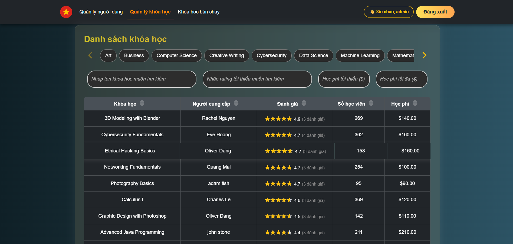

# Coursera-like platform.

## 🔧 How to Run

### Backend
1. Java 17+, Maven 3.9.6
3. Configure `application.yml` with your database credentials
4. Run the application using your IDE or `mvn spring-boot:run`

### Frontend
1. Navigate to the frontend directory at https://github.com/GiaLongDangPham/Coursera_FE
2. Run `npm install`
3. Start the app using `ng serve`

### 📸 Description

#### 👥 User Management UI
Manage users with full CRUD operations, search, validation and paging.

#### ✅ Validation, Search, and Sorting
Client-side validation, search by name, and sortable columns.

#### 📝 Course Interface
View and manage courses from users.

#### 🔍 Filter, Search and Sort Courses
Filter and search course reviews based on course name, user, or rating.

#### 🔐 Basic Login Page
Simple login screen with hardcoded credentials for demonstration.

